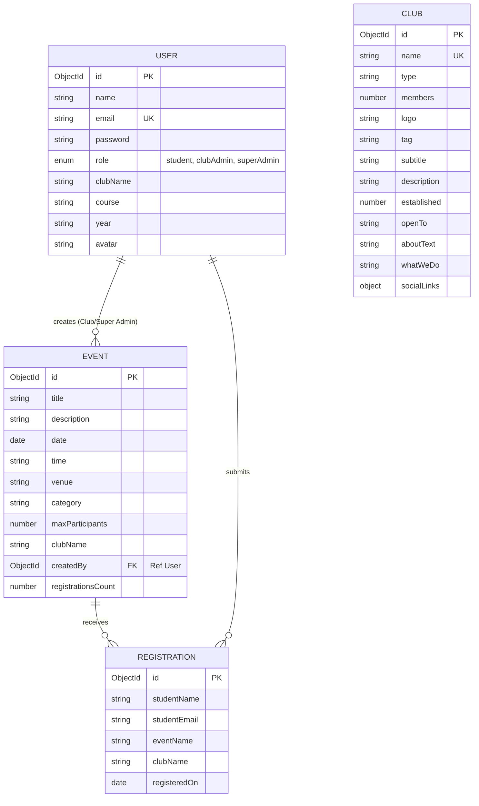

# DJSphere 🌌
> **Premium Campus Club & Event Management Portal**

DJSphere is a modern, full-stack campus event and student club management platform tailored for academic institutions (inspired by Dwarkadas J. Sanghvi College of Engineering). It bridges the gap between students, club organizers, and college administrators. With a premium interactive 3D landing page, intuitive dashboards, and robust role-based access control, DJSphere makes finding, registering for, and managing college events effortless.

---

## 🛠️ Tech Stack

DJSphere uses a modern, high-performance, and secure technology stack:

### Frontend
- **Framework**: [React 19](https://react.dev/) (Vite-powered for lightning-fast builds)
- **State Management**: [Redux Toolkit](https://redux-toolkit.js.org/) & `react-redux`
- **Routing**: [React Router DOM v7](https://reactrouter.com/) (fully protective routing based on user authentication and role scopes)
- **Styling**: [Tailwind CSS v4](https://tailwindcss.com/) (using the new `@tailwindcss/vite` compiler)
- **UI Components**: [Shadcn UI](https://ui.shadcn.com/) & [Base UI](https://base-ui.com/)
- **Animations**: [Framer Motion](https://www.framer.com/motion/) & [GSAP](https://gsap.com/) (for micro-interactions, smooth page transitions, and landing page sequences)
- **3D Graphics**: [Three.js](https://threejs.org/) with `@react-three/fiber` and `@react-three/drei` (renders an interactive low-poly floating island on the landing page)

### Backend
- **Runtime Environment**: [Node.js](https://nodejs.org/) (ES Modules configuration)
- **Framework**: [Express 5](https://expressjs.com/) (routing, cookies, and error handling middleware)
- **Authentication**: JWT-based session security with HTTP-only cookies (`cookie-parser`) and `bcryptjs` password hashing
- **CORS Configuration**: Secure cross-origin resource sharing configured dynamically

### Database
- **Database**: [MongoDB Atlas](https://www.mongodb.com/atlas) (Cloud-hosted NoSQL)
- **ODM**: [Mongoose 9](https://mongoosejs.com/) (for schema verification, validation, and object modeling)

---

## 🌟 Features Implemented

### 1. Interactive 3D Landing Page
- A premium, interactive 3D floating island rendered in real-time using Three.js (WebGL).
- Animated cloud systems, rotating structures, water tiles, and trees that react to mouse hover.
- Live campus statistics (total clubs, events, registrations) fetched dynamically from the database.

### 2. User Authentication & Authorization
- Secure JWT-based registration and login system with cookies.
- Strict role-based routing protecting Student directories, Club Admin tools, and Super Admin panels.
- Profile management panel allowing students to update their credentials and change passwords.

### 3. Student Features
- **Club Discovery**: Browse student chapters (CSI, IEEE, CodeAI, etc.) and specialized teams (DJS Racing, Robocon, Kronos) with detailed information sheets.
- **Event Registrations**: Browse upcoming events (workshops, hackathons, cultural festivals), view details, and register with a single click.
- **My Registrations Portal**: View personalized event history and track registered events.

### 4. Club Admin Panel
- **Dashboard Stats**: Access analytics regarding total events hosted, total student registrations, and unique student participation charts.
- **Event CRUD Operations**: Create, view, update, and delete events for their specific club.
- **Registration Manager**: Monitor live student registrations for their club's events.

### 5. Super Admin Panel
- **Global Dashboard**: Track overall institutional performance (total active clubs, total users, global registration distributions).
- **Club Creator**: Define and establish new clubs or student chapters.
- **User Directory**: Full read access to the campus directory (excluding hashed passwords) to monitor active student and administrator profiles.

---

## 🗄️ Database & Schema Overview

DJSphere uses four interconnected MongoDB collections. Relationships are handled through MongoDB ObjectIds and denormalized tracking (e.g. `registrationsCount`).



### 1. User Schema (`User.js`)
- Stores user credentials, details, avatars, and authorization scopes.
- Has a pre-save hook that auto-hashes passwords using `bcryptjs` (salt factor 10).
- Implements custom instance method `matchPassword` to simplify validation.

### 2. Club Schema (`Club.js`)
- Captures details about college clubs, branches, teams, member count, established year, description, and social media handles.

### 3. Event Schema (`Event.js`)
- Defines properties for individual activities (e.g., date, venue, category, capacity caps).
- Stores a reference `createdBy` linking to the administrator who hosted the event.

### 4. Registration Schema (`Registration.js`)
- Logs successful student registrations. Links students dynamically to events via matching email/event/club criteria.

---

## 🔑 Test Accounts

We have pre-configured test profiles in the live MongoDB Atlas database. You can log into the deployed/local application directly using the following credentials:

| Role | Email | Password | Permissions / Scopes |
| :--- | :--- | :--- | :--- |
| **Super Admin** | `mainadmin@gmail.com` | `123456` | Create clubs, view all users, global dashboard metrics, CRUD on all events. |
| **Club Admin** | `clubadmin1@gmail.com` | `123456` | Manage club events, view registrations for DJS CodeAI, club-specific analytics. |
| **Student** | `karangutkaryagyata@gmail.com` | `123456` | Browse events, join clubs, view private student registration history. |

---

## 🚀 Setup & Installation Instructions

Follow these steps to run DJSphere locally:

### Prerequisites
- [Node.js](https://nodejs.org/) (v16 or higher)
- [MongoDB Atlas](https://www.mongodb.com/) (or local MongoDB database instance)

### 1. Clone the Repository
```bash
git clone https://github.com/yagyataKarangutkar/DJSphere.git
cd DJSphere
```

### 2. Configure Backend Server
Navigate to the `server` directory and install dependencies:
```bash
cd server
npm install
```

Create a `.env` file in the `server` folder (or duplicate `.env.example`):
```env
PORT=5000
MONGO_URI=mongodb+srv://<username>:<password>@cluster.mongodb.net/djsphere?retryWrites=true&w=majority
JWT_SECRET=your_jwt_secret_key_here
JWT_EXPIRES_IN=7d
FRONTEND_URL=http://localhost:3001/
```

Start the backend server in development mode:
```bash
# Run with nodemon auto-restart
npm run dev
```
*(The server will boot and connect to MongoDB. If the collections are empty, the seeding function inside [seed.js](file:///c:/Users/UMESH/OneDrive/Desktop/projects/DJSphere/server/config/seed.js) will auto-populate mock clubs and events).*

### 3. Configure Frontend Client
In a new terminal window, navigate to the `client` directory and install dependencies:
```bash
cd client
npm install
```

Create a `.env` file in the `client` folder:
```env
VITE_API_URL=http://localhost:5000
```

Start the Vite development server:
```bash
npm run dev
```

The application will launch. Open [http://localhost:3001](http://localhost:3001) (or the port specified by Vite) in your browser.

---

## 🎨 External Templates & References Used

- **3D Graphics**: Inspired by low-poly isometric grid design principles. Built using `@react-three/fiber` declarative wrappers for standard WebGL renderers.
- **Icons**: [Lucide React](https://lucide.dev/) library for icons across all navigation, sidebar, and dashboard tabs.
- **Typography**: [Geist Variable Font](https://fontsource.org/fonts/geist-variable) loaded via Fontsource to give a sleek, clean, code-like modern aesthetic.
- **Mock Images**: Placeholder high-quality imagery hosted via [Unsplash](https://unsplash.com/) for profiles and event covers.
- **UI Architecture**: Tailwind CSS configuration inspired by [Shadcn UI styling variables](https://ui.shadcn.com/docs/theming).
